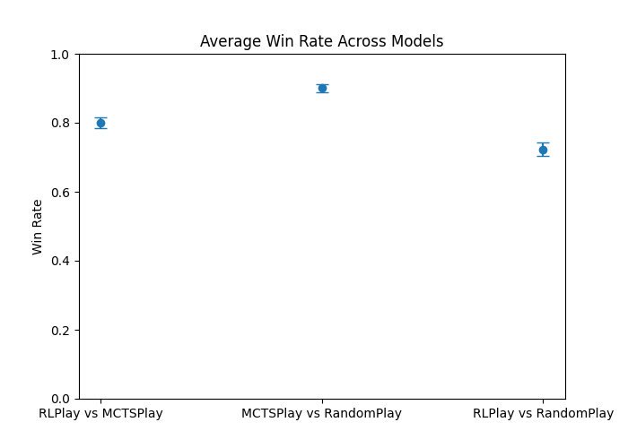
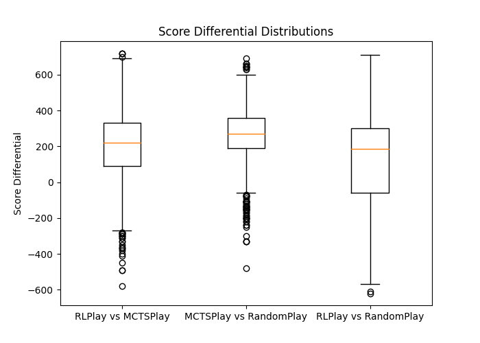

# Intro
This represents the card game Spades, implemented in such a way as to make other games straightforward to create as well. [util.py](/util.py) contains the Game class, a Rules interface that controls how the game is played, a representation of Cards, and an interface for a Player. For convenience, a basePlayer class is provided for handling basic tasks involved with player creation. An explanation of the rules of Spades can be found [here](https://www.thesprucecrafts.com/spades-complete-card-game-rules-412490).

### Setup
  
Install Docker: https://www.docker.com/products/docker-desktop/

```
cd SIMPLE
docker-compose up -d
bash scripts/install_env.sh spades
```

### Training the RL Agent

For N simultaneous training sessions:

```
cd SIMPLE
docker-compose exec app mpirun -np N python3 train.py -e spades
```

### Run
```
docker-compose exec app python3 play.py -a [model1] [model2] [model3] [model4] -g [NumGames]
```
or
```
docker-compose exec app python3 play.py -a [model1] [model2] -g [NumGames]
```

-g parameter is optional, defaults to 1

## Results
All data can be found in .csv files contained within ./SIMPLE/app/output/
In addition, it contains the following two graphs:





## Resources: 
- Bidding Algorithm: https://ecai2020.eu/papers/235_paper.pdf
- Monte Carlo Tree Search: https://ai-boson.github.io/mcts/
- Reinforcement Learning on Spades: https://cs229.stanford.edu/proj2021spr/report2/81999416.pdf
- SIMPLE Reinforcement learning library: https://github.com/davidADSP/SIMPLE
- RL Agent for Hearts: https://fse.studenttheses.ub.rug.nl/15440/1/Bachelor_Thesis_-_Maxiem_Wagen_1.pdf

## ToDo
- [x] Complete Bidding Algorithm (AIPlayer.getBid(state)) in [players.py](/players.py)
  - [x] Implement bidding nil
  - [x] Implement regular bidding
- [x] Implement AIPlayer.play(state) in [players.py](/players.py)
- [ ] ~~expectiminimax player agent~~
- [x] MCTS player agent
- [ ] RL player agent
- [x] Tournament of different agents
  - [x] save results to CSV file for further analysis
- [x] Make Spades object track points [util.py](/util.py)
- [x] create isWon(state) method on Rules interface and implement in Spades object [util.py](/util.py)
- [x] Allow Game to run turns until a win state in [util.py](/util.py), have [play.py](/play.py) use this method
- [x] Force the player to replay if their original move is not valid
- [x] Generate graphs